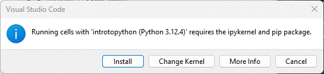

# IntroToPython
example files from the Deitel/Pearson book

# IntroToPython

> Developer tooling for [IntroToPython](https://github.com/pdeitel/IntroToPython/)

This repository does NOT redistribute example files from the Deitel/Pearson book.
Students must obtain the book and its accompanying materials separately.

Note:
Due to evolving software and incomplete snippets, not all code will run without additional work.
This repo is used to make much of the code runnable or inspectable in VS Code.

## Recommended Installations

- git
- Python
- VS Code (and extensions)

## Developer

This repository provides a professional working environment;
the book examples are added locally.

### 1. Clone this repo

```shell
git clone https://github.com/denisecase/IntroToPython
cd IntroToPython
code .
```

### 2. Obtain the textbook example files

- See the official Deitel repository at <https://github.com/pdeitel/IntroToPython>.
- Copy the book's `examples/` folder into this repository.
- Ensure `examples/` is parallel to the `images/` folder (both in root).

### 3. Install `uv`

- See [Step 3: Install Tools](https://denisecase.github.io/pro-analytics-02/01-set-up-machine/) for instructions by operating system.

### 4. Initialize (Just Once)

Use VS Code menu option `Terminal` / `New Terminal` to open a **VS Code terminal** in the root project folder.
Run the following commands, one at a time, hitting ENTER after each:

```shell
uv self update
uv python pin 3.14
uv sync --extra dev --extra docs --upgrade

# the audio features require additional installs
# start by adding the [audio] packages listed in pyproject.toml:
uv sync --extra dev --extra docs --extra audio --upgrade
```

If asked: "We noticed a new environment has been created. Do you want to select it for the workspace folder?" Click **"Yes"**.

If successful, you'll see a new `.venv` folder appear in the root project folder.

### 5. Run Individual Examples

If you see something like this, click "Install".

  

Run a file (e.g., the Roll Die Dynamic simulation):

```shell
uv run python examples\ch01\RollDieDynamic.py 100 1
```

If a window pops up, close the window (or if needed, **delete the terminal**) to continue.

Open Notebooks and Click `Run All`. Select the kernel associated with this repo `.venv`.

### 6. Save Progress (As Needed)

If you update your copy of the examples, you might want to save progress.

```shell
git add -A
git commit -m "update"
git push -u origin main
```

## Citation

This repository does not redistribute textbook example files.
If you add the Deitel/Pearson examples locally, please respect the book's copyright
and do not publish or redistribute those files.

[CITATION.cff](./CITATION.cff)

## License

[MIT](./LICENSE)

## Notice

[NOTICE.md](./NOTICE.md)

## UPSTREAM

[UPSTREAM.md](./UPSTREAM.md)

## Annotations

[Annotations.md](./ANNOTATIONS.md)

## SE MANIFEST

[SE_MANIFEST.toml](./SE_MANIFEST.toml)
